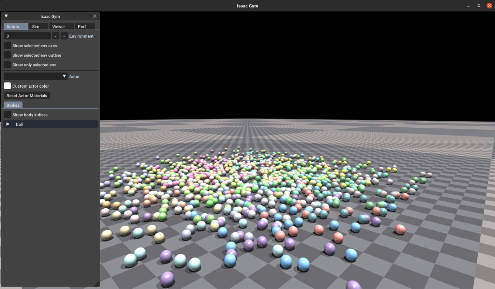
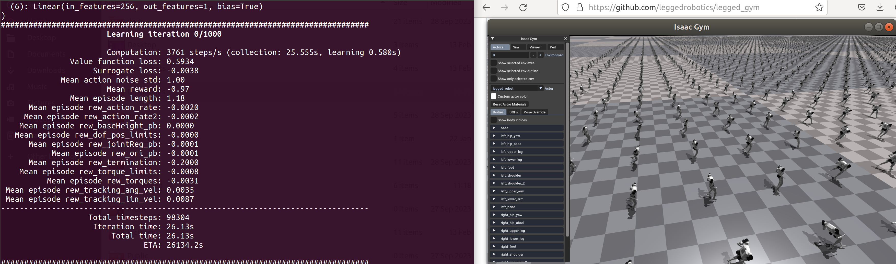

# Program Overview 

**Duration**: 07/08-07/30

**Instructor**: Professor Hao Su, Ivan Sanchez (postdoc), Junxi Zhu (PhD student)

**Location**: Engineering Building III (for in-person students only)

**Time**: TBD

**Topics**:

* Reinforcement learning basics (including a cart-pole code example on Google Colab)
* Humanoid robot simulation project using reinforcement learning

# Tentative Syllabus

| Week | Lecture | Content | Homework Assignment | 
| :---: | :---: | --- | --- |
| 1 | 1 | Program overview | See [Paper List](#paper-list) |
| 1 | 2 | Install software environment (Ubuntu, MuJoCo, IsaacGym) |  |
| 2 | 3 | Reinforcement learning basics<br>Cart-pole example | See [Homework 1 Cart-Pole Example](#homework-1-cart-pole-example) | 
| 2 | 4 | Define custom URDF file for robots and visualize in MuJuCo |  |
| 3 | 5 | Introduction to humanoid robots<br>Reward function formulation | See [Homework 2 Reward Function Formulation](#homework-2-reward-function-formulation)
| 3 | 6 | Tune reward function and train humanoid robot controller | See [Homework 3 Humanoid Virtual Competition](#homework-3-humanoid-virtual-competition) |
| 4 | 7 | Poster feedback | Poster must be completed by July 25 |


# Hardware and Software Requirement

It is strongly recommended that you have a computer with **Linux 18.04** operating system and a **Nvidia GPU** that supports CUDA. They are necessary for the reinforcement learning project.

For in-person students, if you are not able to meet this requirement, you may use the computer we provide in the lab. Two students form a group and share one computer. A total of four computers are available in the lab.

For remote students, you may use the Virtual Computing Lab (VCL) facilities provided by the university. Details TBD.

# Paper List

* **[Humanoid]** S. H. Jeon, S. Heim, C. Khazoom, and S. Kim, “Benchmarking Potential Based Rewards for Learning Humanoid Locomotion,” in 2023 IEEE International Conference on Robotics and Automation (ICRA), London, United Kingdom, May 2023, pp. 9204–9210.
* **[Hutter19 Science Robotics]** J. Hwangbo, J. Lee, A. Dosovitskiy, D. Bellicoso, V. Tsounis, V. Koltun, and M. Hutter, “Learning agile and dynamic motor skills for legged robots,” Science Robotics, vol. 4, no. 26, p. eaau5872, Jan. 2019.
* **[Hutter20 Science Robotics]** J. Lee, J. Hwangbo, L. Wellhausen, V. Koltun, and M. Hutter, “Learning quadrupedal locomotion over challenging terrain,” Science Robotics, vol. 5, no. 47, p. eabc5986, Oct. 2020.
* **[ETH Hutter 2022 ICRA]** [Legged Robots on the way from subterranean](https://www.youtube.com/watch?v=XwheB2_dyMQ)
* **[Our 2024 Nature]** S. Luo, M. Jiang, S. Zhang, J. Zhu, S. Yu, I. Dominguez Silva, T. Wang, E. Rouse, B. Zhou, H. Yuk, X. Zhou, and H. Su, “Experiment-free exoskeleton assistance via learning in simulation,” Nature, vol. 630, no. 8016, pp. 353–359, Jun. 2024.
* **[Davide23 Nature]** E. Kaufmann, L. Bauersfeld, A. Loquercio, M. Müller, V. Koltun, and D. Scaramuzza, “Champion-level drone racing using deep reinforcement learning,” Nature, vol. 620, no. 7976, pp. 982–987, Aug. 2023. | [Seminar Talk](https://www.youtube.com/watch?v=tb1SCib0OTo)

<br>

# Cart-Pole Example

# Homework 1 Cart-Pole Example

Placeholder

# Humanoid Project

**Paper**: Jeon, S. H., Heim, S., Khazoom, C., & Kim, S. (2023, May). Benchmarking potential based rewards for learning humanoid locomotion. In 2023 IEEE International Conference on Robotics and Automation (ICRA) (pp. 9204-9210).

## Installation

* Create the virtual environment using Python 3.6.9 (``user`` is your machine username)
  
  ```bash
  virtualenv /home/user/MITlegged --python=python3
  ```

* Activate the virtual environment

  ```bash
  source /home/user/MITlegged/bin/activate
  ```

   **Note**: You should see the name of the active virtual environment in parenthesis at the begining of the line.
      Something like this ``(MITlegged)user@PCname:~$``.
    

* Install required libraries (pythorch 1.10 and cuda 11.3)

  ```bash
  pip install torch==1.10.0+cu113 torchvision==0.11.1+cu113 torchaudio==0.10.0+cu113 -f https://download.pytorch.org/whl/cu113/torch_stable.html
  ```

* Install Isaac Gym

  1. Download Isaac Gym Preview 4 from https://developer.nvidia.com/isaac-gym
  2. Extract the zip package in the MITlegged virtual environment folder.
  3. ``cd isaacgym_lib/python && pip install -e .`` to install the requirements.
  4. Test the installation by running an example: ``cd isaacgym/python/examples && python 1080_balls_of_solitude.py``.
  
  **Note**:: You should be able to see a new window apperaing with a group of balls falling
  
  
  
* Clone the pbrs-humanoid repository and initialize the submodules
  
  1. ``git clone https://github.com/se-hwan/pbrs-humanoid.git``
  2. ``cd pbrs-humanoid/gpugym && git submodule init && git submodule update``

  **Note**: In case you dont have git installed: ``sudo apt-get install git``. Then, clone the repository.
  
* Install gpu_rl (Proximal Policy Optimization - PPO implementation)

  ``cd pbrs-humanoid/gpu_rl && pip install -e .``

* Install gpuGym

  ``cd .. && pip install -e .``

* Install WandB (for tracking on the learned policy during the training stage)

  ``pip install wandb==0.15.11``

## Usage

**Training the controller**: ``python gpugym/scripts/train.py --task=pbrs:humanoid``
  
**Note**: You should see something like this

* To run on CPU add following arguments: --sim_device=cpu, --rl_device=cpu (sim on CPU and rl on GPU is possible).
* To run headless (no rendering) add --headless.
* Important: To improve performance, once the training starts press v to stop the rendering. You can then enable itlaterto check the progress.
* The trained policy is saved in gpugym/logs/[experiment_name]\/[date_time]\_[run_name]\/model_[iteration].pt, where [experiment_name] and [run_name] are defined in the train config.
* The following command line arguments override the values set in the config files:
  * ``--task`` TASK: Task name.
  * ``--resume`` Resume training from a checkpoint
  * ``--experiment_name`` EXPERIMENT_NAME: Name of the experiment to run or load.
  * ``--run_name`` RUN_NAME: Name of the run.
  * ``--load_run`` LOAD_RUN: Name of the run to load when resume=True. If -1: will load the last run.
  * ``--checkpoint`` CHECKPOINT: Saved model checkpoint number. If -1: will load the last checkpoint.
  * ``--num_envs`` NUM_ENVS: Number of environments to create.
  * ``--seed`` SEED: Random seed.
  * ``--max_iterations`` MAX_ITERATIONS: Maximum number of training iterations.

* Implement the trained policy

  ``python gpugym/scripts/play.py --task=pbrs:humanoid``

  **Note**: This is the result: https://www.youtube.com/watch?v=4AzTJMkW2ZA

  * By default the loaded policy is the last model of the last run of the experiment folder.
  * Other runs/model iteration can be selected by setting ``load_run`` and ``checkpoint`` in the train config.

# Homework 2 Reward Function Formulation

Placeholder

# Homework 3 Humanoid Virtual Competition

Placeholder


