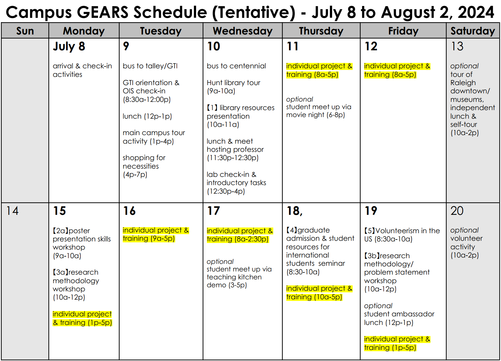
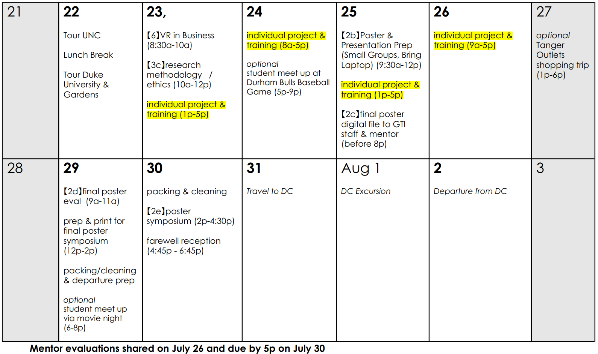
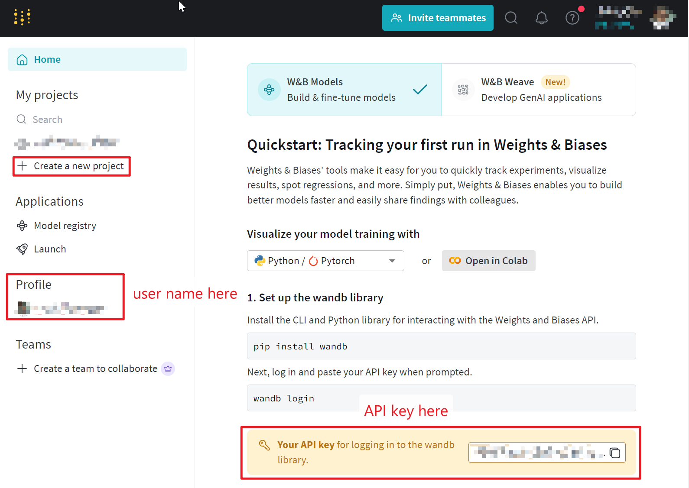

# Program Overview 

**Duration**: 07/08-07/30

**Instructor**: Professor Hao Su, Ivan Sanchez (postdoc), Junxi Zhu (PhD student)

**Location**: Room 3209, Engineering Building III (unless otherwise specified; for in-person students only)

**Time**: TBD

**Zoom link**: https://ncsu.zoom.us/my/junxizhu

**Topics**:

* Reinforcement learning basics (including a cart-pole code example on Google Colab)
* Humanoid robot simulation project using reinforcement learning

# GEARS Program Schedule

 



# Tentative Syllabus for Individual Project & Training

| Week | Lecture | Content (in New York time) | Homework (due in 1 week) | 
| :---: | :---: | --- | --- |
| 1 | 1 | Introduction to robot control with reinforcement learning (07/11, 10a - 11:30a, Room 3209, Enginnering Building III) | See [Paper List](#paper-list) |
| 1 | 2 | Project Overview (cart-pole + humanoid robot) <br> Introduction to Ubuntu, MuJoCo, IsaacGym & Custom URDF files and visualize in MuJoCo (07/12, 10a - 11:30a, Room 3209, Enginnering Building III) | |
| 2 | 3 | Introduction to Reinforcement learning <br> Cart-pole example  (Date TBD) | See [Homework 1 Compute Network Parameters and Compare Controller Performance](#homework-1-compute-network-parameters-and-compare-controller-performance) |
| 2 | 4 | Introduction to humanoid robots<br>Reward function formulation (Date TBD) | See [Homework 2 Reward Function Formulation](#homework-2-reward-function-formulation)
| 3 | 5 | Tune reward function and train humanoid robot controller (Date TBD) | See [Homework 3 Humanoid Virtual Competition](#homework-3-humanoid-virtual-competition) |
| 3 | 6 | Poster feedback | Poster must be completed by July 25 |

# Hardware and Software Requirements

It is strongly recommended that you have a computer with **Linux 18.04** operating system and a **Nvidia GPU** that supports CUDA with **more than 8 GB of VRAM**. They are necessary for the reinforcement learning project.

For in-person students, if you are not able to meet this requirement, you may use the computer we provide in the lab. Two students form a group and share one computer. A total of four computers are available in the lab.

For remote students, you may use the Virtual Computing Lab (VCL) facilities provided by the university. Details TBD.

# Paper List

* **[Jeon23 ICRA]** S. H. Jeon, S. Heim, C. Khazoom, and S. Kim, “Benchmarking Potential Based Rewards for Learning Humanoid Locomotion,” in 2023 IEEE International Conference on Robotics and Automation (ICRA), London, United Kingdom, May 2023, pp. 9204–9210.
* **[Hutter19 Science Robotics]** J. Hwangbo, J. Lee, A. Dosovitskiy, D. Bellicoso, V. Tsounis, V. Koltun, and M. Hutter, “Learning agile and dynamic motor skills for legged robots,” Science Robotics, vol. 4, no. 26, p. eaau5872, Jan. 2019.
* **[Hutter20 Science Robotics]** J. Lee, J. Hwangbo, L. Wellhausen, V. Koltun, and M. Hutter, “Learning quadrupedal locomotion over challenging terrain,” Science Robotics, vol. 5, no. 47, p. eabc5986, Oct. 2020.
   * **Related seminar talk in 2022 ICRA by Prof. Hutter**: [Legged Robots on the way from subterranean](https://www.youtube.com/watch?v=XwheB2_dyMQ)
   * **Related seminar talk in 2021 by Prof. Hwangbo**: [Control Legged Robots Reinforcement Learning](https://www.youtube.com/watch?v=6WLqK2X1RAc)
* **[Our 2024 Nature]** S. Luo, M. Jiang, S. Zhang, J. Zhu, S. Yu, I. Dominguez Silva, T. Wang, E. Rouse, B. Zhou, H. Yuk, X. Zhou, and H. Su, “Experiment-free exoskeleton assistance via learning in simulation,” Nature, vol. 630, no. 8016, pp. 353–359, Jun. 2024.
* **[Davide23 Nature]** E. Kaufmann, L. Bauersfeld, A. Loquercio, M. Müller, V. Koltun, and D. Scaramuzza, “Champion-level drone racing using deep reinforcement learning,” Nature, vol. 620, no. 7976, pp. 982–987, Aug. 2023. | [Seminar Talk](https://www.youtube.com/watch?v=tb1SCib0OTo)
* **[MIT Prof. Patrick Winston]** [How to Speak](https://www.youtube.com/watch?v=Unzc731iCUY)
* **[IIya Sutskever]** [Deep Learning Theory Session: The unreasonable effectiveness of deep learning](https://www.youtube.com/watch?v=OAm6zyR_c8k)
* **[JHU Prof. Rama Chellappa]** [Design of Adaptive Fair and Robust AI Systems](https://www.youtube.com/watch?v=kjxP7fQf3w8)
* **[3Blue1Brown]** [What is a neural network?](https://www.youtube.com/watch?v=aircAruvnKk) | [Gradient descent: how neural networks learn?](https://www.youtube.com/watch?v=IHZwWFHWa-w)
* **[Prof. Hung-yi Li Introduction to Machine Learning]** [Part 1](https://www.youtube.com/watch?v=Y87Ct23H3Kw&list=PLJV_el3uVTsNxV_IGauQZBHjBKZ26JHjd) | [Part 2](https://www.youtube.com/watch?v=O69EqgzUl9U&list=PLJV_el3uVTsNxV_IGauQZBHjBKZ26JHjd&index=3)
* **[Andrej Karpathy]** [Introduction to Large Language Models: core technical component behind ChatGPT, Claude, and Bard](https://www.youtube.com/watch?v=zjkBMFhNj_g)
* **[UC Berkeley Prof. Sergey Levine]** [Data-Driven Reinforcement Learning in Robotics, Language, and Beyond Share](https://www.youtube.com/watch?v=qCpeiYkqMEI) 
* **[NYU Prof. Yann LeCun]** [From Machine Learning to Autonomous Intelligence](https://www.youtube.com/watch?v=pd0JmT6rYcI)

<br>

# Cart-Pole Example

## Objective

1. Understand the basic concepts in reinforcement learning:
  * Environment
  * Agent
  * States
  * Observation
  * Action
  * Reward
  * Policy

2. Compare the performance of the trained policy regarding
  * Number of neurons
  * Number of network hidden layers
  * Training episodes

## Introduction

We will employ Google Colab with OpenAI's Gym and Python for this activity.

### Google Colab

Google Colab, or Google Colaboratory, is a free cloud service provided by Google that allows users to write and execute Python code in a web-based interactive environment.
It offers convenient features such as:

* Free Access to GPUs and TPUs: free access to powerful GPUs and TPUs, making it easier to train machine learning models and perform computations that require significant processing power.

* Interactive Python Notebooks: Colab uses Jupyter Notebook, which supports rich text, visualizations, and code execution in an interactive format.

* Easy Sharing and Collaboration: Notebooks can be easily shared and collaborated on, similar to Google Docs. Multiple users can work on the same notebook simultaneously.

* Integration with Google Drive: Colab integrates seamlessly with Google Drive, allowing you to save and access your notebooks and datasets directly from your Drive.

* Code Execution in the Cloud: Since the code runs on Google's cloud servers, users don't need to worry about the computational limits of their local machines.

* Markdown Support: Users can include formatted text, equations, and visualizations within the notebook using Markdown, enhancing the readability and presentation of the code and results.

### OpenAI Gym

OpenAI Gym is a toolkit developed by OpenAI for developing and comparing reinforcement learning (RL) algorithms. It provides a standardized set of environments (e.g., games, robotic tasks, control problems) that researchers and developers can use to test and evaluate their RL algorithms. Here are some key features of OpenAI Gym:

* Variety of Environments: Gym offers a wide range of environments, including classic control tasks, Atari games, robotic simulations, and more.

* Standard Interface: All environments in Gym follow a standard interface with methods like reset(), step(action), render(), and close(). This makes it easy to switch between different environments without changing the algorithm code.

* Community and Benchmarks: Gym has a strong community of researchers and practitioners who contribute to the toolkit, create new environments, and share results. It also provides benchmarks for comparing the performance of different RL algorithms.

* Integration with Other Libraries: Gym can be easily integrated with popular RL libraries like TensorFlow, PyTorch, and stable-baselines, facilitating the development and testing of RL models.

* Extensibility: Users can create custom environments by following the Gym API, making it suitable for a wide range of applications beyond the provided environments.

### CartPole Environment

OpenAI's Gym environment "CartPole" is a classic control problem in reinforcement learning (RL). The primary objective is to balance a pole on a cart by applying forces to the cart to keep the pole upright. Here's a detailed description of the CartPole environment:

**Goal**

Keep the pole balanced upward and the cart within the track boundaries for as long as possible.

**Environment**

1. Cart and Pole Dynamics:

  * Cart: A small cart that can move left or right along a frictionless track.
  * Pole: A pole attached to the cart by an unactuated rotational joint. The pole starts upright and can fall to either side.

2. State Space:

  * The state is represented by a four-dimensional vector:
    1. cart_position: The position of the cart on the track.
    2. cart_velocity: The velocity of the cart.
    3. pole_angle: The angle of the pole from the vertical.
    4. pole_velocity_at_tip: The velocity of the tip of the pole.

3. Action Space:

  * The action space is discrete with two possible actions:
      * 0: Apply a force to the cart to move it to the left.
      * 1: Apply a force to the cart to move it to the right.

4. Reward:

  * The agent receives a reward of +1 for every time step the pole remains upright and within the allowed boundaries.

5. Termination Conditions (episode):

  * The pole angle exceeds ±12 degrees from the vertical.
  * The cart position exceeds ±2.4 units from the center.
  * The episode length reaches a maximum of 200 time steps (configurable in some versions).

## Set up

1. Create a new Google Colab Notebook

2. Install the following libraries (create a new code block for each step)
  ```bash
    !pip install tensorflow==2.11.0
    !pip install keras==2.11.0
    !pip install keras-rl2
    !pip install gym[classic_control]==0.18.3
  ```

3. Import the libraries
  ```bash
    import os
    os.environ["SDL_VIDEODRIVER"] = "dummy"
    import numpy as np
    import tensorflow as tf
    from tensorflow.keras.models import Sequential
    from tensorflow.keras.layers import Dense, Flatten
    from tensorflow.keras.optimizers import Adam
    import gym
    import random
    from rl.agents import DQNAgent
    from rl.policy import BoltzmannQPolicy
    from rl.memory import SequentialMemory
    import matplotlib.pyplot as plt
  ```

4. Create the environment
  ```bash
    env = gym.make('CartPole-v1')
    states = env.observation_space.shape[0]
    actions = env.action_space.n
    observations = env.reset()
  ```
  **NOTE:** try ``[actions, states, observations]`` after the previous block. You will see the amount of states, actions, and the value of the observations. Notice that the size of the first element of ``observations`` corresponds to the value of ``states``.

5. Run the simulation
  ```bash
    scoress = []
    episodes = 30
    for episode in range(1, episodes+1):
        state = env.reset()
        done = False
        score = 0
        while not done:
            env.render()
            action = random.choice([0,1])
            n_state, reward, done, info = env.step(action)
            score+=reward
        print('Episode:{} Score:{}'.format(episode, score))
        scoress.append(score)
  ```
You must see a list with the episode and their obtained reward.

In Google Colab,  it is important to note that there is no display driver available for generating videos. However, it is possible to install a virtual display driver to get it to work so you can see the response system's responce to actions

6. Installing the libraries for recording the video
  ```bash
    !apt-get install -y xvfb x11-utils
    !pip install pyvirtualdisplay==0.2.*
  ```

7. Starting an instance of the virtual display
  ```bash
    from pyvirtualdisplay import Display
    display = Display(visible=False, size=(1400, 900))
    _ = display.start()
  ```

OpenAI gym has a VideoRecorder wrapper that can record a video of the running environment in MP4 format.

8. The code below is the same as before except that it is for 200 steps and is recording.
  ```bash
    from gym.wrappers.monitoring.video_recorder import VideoRecorder
    before_training = "before_training.mp4"

    video = VideoRecorder(env, before_training)
      # returns an initial observation
    env.reset()
    for i in range(200):
      env.render()
      video.capture_frame()
      # env.action_space.sample() produces either 0 (left) or 1 (right).
      observation, reward, done, info = env.step(env.action_space.sample())

    video.close()
    env.close()
  ```

9. Function to create and encode the video
  ```bash
    from base64 import b64encode
    def render_mp4(videopath: str) -> str:
      """
      Gets a string containing a b4-encoded version of the MP4 video
      at the specified path.
      """
      mp4 = open(videopath, 'rb').read()
      base64_encoded_mp4 = b64encode(mp4).decode()
      return f'<video width=400 controls><source src="data:video/mp4;' \
            f'base64,{base64_encoded_mp4}" type="video/mp4"></video>'
  ```

10. Rendering and displaying the obtained video
  ```bash
    from IPython.display import HTML
    html = render_mp4(before_training)
    HTML(html)
  ```

**NOTE:** You must be able to see a video like this

https://github.com/biomechatronics001/NCSU-GEARS-Reinforcement-Learning-Humanoid-Control/assets/50973445/ccd937ca-15c7-4662-928a-3685243fdd5a

## Homework 1 Compute Network Parameters and Compare Controller Performance

Based on the [Examples](#examples) obtained using the code in https://colab.research.google.com/drive/1_8QPXhnxju08xjuRWhNm2vN7LZlh5kbf#scrollTo=uINMg_bZQvnA:

**Compare the performance and reward values per episode for different models employing the same agent (Deep Q-Network)**

1. Training episodes: Model with 2 hidden layers and 24 neurons per layer with relu activation funcions for the hidden layers and a linear activation function for the output layer.
    * 5,000 training episodes.
    * 10,000 training episodes.
    * 20,000 training episodes.

2. Number of neurons per layer: Model with 2 hidden layers with relu activation funcions for the hidden layers and a linear activation function for the output layer, 5000 training episodes.
    * 24 neurons per layer
    * 32 neurons per layer
    * 40 neurons per layer

3. Number of hidden layers: Model with 24 neurons per layer with relu activation funcions for the hidden layers and a linear activation function for the output layer, 5,000 training episodes.
    * 2 hidden layers
    * 4 hidden layers
    * 6 hidden layers

**HINT:** you can use several google colab notebooks simultaneously to accelerate the procces of training each model.

### Deliverables

1. Diagram of each of the neural network architectures (without repeating them) specifying:
    * Number of inputs
    * Number of outputs
    * Weights between each layer (trainable parameters)
    * Biases (per layer)
    * Total of trainable parameters


### Examples

1. Deep Q-Network Agent with 2 hidden layers with 24 neurons each and rectified linear units as activation functions, trained for 5000 episodes.

https://github.com/biomechatronics001/NCSU-GEARS-Reinforcement-Learning-Humanoid-Control/assets/50973445/ef366702-e83c-48d6-bae2-4f648b5fb358

2. Deep Q-Network Agent with 2 hidden layers with 32 neurons each and rectified linear units as activation functions, trained for 50000 episodes.

https://github.com/biomechatronics001/NCSU-GEARS-Reinforcement-Learning-Humanoid-Control/assets/50973445/fc57668f-783e-4e4e-9e20-8a0252a148f4

As you can see, even with the same agent, different performance can be obtaining by increasing the number of neurons or the training episodes.

# Humanoid Project

## Objective

1. Have a deeper understanding of the concepts in reinforcement learning through this more advanced example.
2. Create a URDF file for a custom robot.
3. Tune the reward function and understand the influence of different reward terms on the controller performance. 

**Paper**: S. H. Jeon, S. Heim, C. Khazoom, and S. Kim, “Benchmarking Potential Based Rewards for Learning Humanoid Locomotion,” in 2023 IEEE International Conference on Robotics and Automation (ICRA), London, United Kingdom, May 2023, pp. 9204–9210.


## Installation

* Create the virtual environment using Python 3.8 (``user`` is your machine username; you may also use Anaconda to create and manage the virtual environment)
  
  ```bash
  virtualenv /home/user/leggedrobot --python=python3
  ```

* Activate the virtual environment

  ```bash
  source /home/user/leggedrobot/bin/activate
  ```

   **Note**: You should see the name of the active virtual environment in parenthesis at the begining of the line.
      Something like this ``(leggedrobot)user@PCname:~$``.
    

* Install required libraries (pythorch 1.10 and cuda 11.3)

  ```bash
  pip install torch==1.10.0+cu113 torchvision==0.11.1+cu113 torchaudio==0.10.0+cu113 -f https://download.pytorch.org/whl/cu113/torch_stable.html
  ```

* Install Isaac Gym

  1. Download Isaac Gym Preview 4 from https://developer.nvidia.com/isaac-gym
  2. Extract the zip package in the virtual environment folder.
  3. ``cd isaacgym_lib/python && pip install -e .`` to install the requirements.
  4. Test the installation by running an example: ``cd isaacgym/python/examples && python 1080_balls_of_solitude.py``.
  
  **Note**:: You should be able to see a new window apperaing with a group of balls falling
  
  
  
* Clone the pbrs-humanoid repository and initialize the submodules
  
  ```bash
  git clone https://github.com/se-hwan/pbrs-humanoid.git
  ```
  ```bash
  cd pbrs-humanoid/gpugym && git submodule init && git submodule update
  ```

  **Note**: In case you dont have git installed: ``sudo apt-get install git``. Then, clone the repository.
  
* Install gpu_rl (Proximal Policy Optimization - PPO implementation)

  ```bash
  cd pbrs-humanoid/gpu_rl && pip install -e .
  ```

* Install gpuGym

  ```bash
  cd .. && pip install -e .
  ```

* Install WandB (for tracking on the learned policy during the training stage)

  ```bash
  pip install wandb==0.15.11
  ```

## Setup Wandb for logging

1. Create an account on https://wandb.ai/site.

2. Copy your personal API key from the homepage.

    

3. Create a new project from the homepage.

4. In the virtual environment, execute the following and enter your API key and prese Enter. Note that for security reasons, the key you entered/pasted will not be visible.

    ```bash
    wandb login
    ```

## Train the control policy

To start the training, execute the following:

```bash
python gpugym/scripts/train.py --task=pbrs:humanoid --experiment_name=<NAME> --run_name=<NAME> --wandb_project=<NAME> --wandb_entity=<NAME> --wandb_name=<NAME>
```
  
**Note**: You should see something like this

* To run on CPU add following arguments: ``--sim_device=cpu``, ``--rl_device=cpu`` (sim on CPU and rl on GPU is possible).
* To run headless (no rendering) add ``--headless``.
* Important: To improve training speed, once the training starts press the key *V* to stop the rendering. You can then enable it later by pressing the key *V* again to check the progress.
* The trained policy is saved in gpugym/logs/[experiment_name]\/[date_time]\_[run_name]\/model_[iteration].pt, where [experiment_name] and [run_name] are defined in the train config.
* The following command line arguments override the values set in the config files:
  * ``--task`` TASK: Task name.
  * ``--resume`` Resume training from a checkpoint
  * ``--experiment_name`` EXPERIMENT_NAME: Name of the experiment to run or load.
  * ``--run_name`` RUN_NAME: Name of the run.
  * ``--load_run`` LOAD_RUN: Name of the run to load when resume=True. If -1: will load the last run.
  * ``--checkpoint`` CHECKPOINT: Saved model checkpoint number. If -1: will load the last checkpoint.
  * ``--num_envs`` NUM_ENVS: Number of environments to create.
  * ``--seed`` SEED: Random seed.
  * ``--max_iterations`` MAX_ITERATIONS: Maximum number of training iterations.
  * ``-wandb_project`` WANDB_PROJECT: Project name on Wandb.
  * ``wandb_entity`` WANDB_ENTITY: This is your Wandb user name from the homepage.
  * ``wandb_name`` WANDB_NAME: This is the display name of your run on Wandb.

## Run the trained policy

  ```bash
  python gpugym/scripts/play.py --task=pbrs:humanoid
  ```

  **Note**: This is the result: https://www.youtube.com/watch?v=4AzTJMkW2ZA

  * By default the loaded policy is the last model of the last run of the experiment folder.
  * Other runs/model iteration can be selected by setting ``load_run`` and ``checkpoint`` in the train config.

# Homework 2 Reward Function Formulation

Please reproduce Fig. 3 and Fig. 5 of the paper.

Placeholder

# Homework 3 Humanoid Virtual Competition

Placeholder


