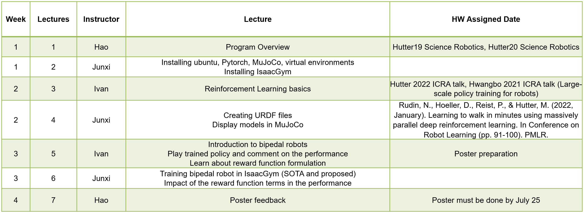

# Program Overview 

**Duration**: 07/08-07/30

**Instructor**: Professor Hao Su, Ivan Sanchez (postdoc), Junxi Zhu (PhD student)

**Location**: Engineering Building III (for in-person students only)

**Time**: TBD

**Topics**:

* Reinforcement learning basics (including a cart pole code example on Google Colab)
* Humanoid robot simulation project using reinforcement learning

# Tentative Syllabus

# Hardware and Software Requirement

It is strongly recommended that you have a computer with **Linux 18.04** operating system and a **Nvidia GPU** that supports CUDA. They are necessary for the reinforcement learning project.

For in-person students, if you are not able to meet this requirement, you may use the computer we provide in the lab. Two students form a group and share one computer. A total of four computers are available in the lab.

For remote students, you may use the Virtual Computing Lab (VCL) facilities provided by the university. Details TBD.

# Papers and talks related to the program

## Papers
* **[Humanoid]** S. H. Jeon, S. Heim, C. Khazoom, and S. Kim, “Benchmarking Potential Based Rewards for Learning Humanoid Locomotion,” in 2023 IEEE International Conference on Robotics and Automation (ICRA), London, United Kingdom, May 2023, pp. 9204–9210.
* **[Hutter19 Science Robotics]** J. Hwangbo, J. Lee, A. Dosovitskiy, D. Bellicoso, V. Tsounis, V. Koltun, and M. Hutter, “Learning agile and dynamic motor skills for legged robots,” Science Robotics, vol. 4, no. 26, p. eaau5872, Jan. 2019.
* **[Hutter20 Science Robotics]** J. Lee, J. Hwangbo, L. Wellhausen, V. Koltun, and M. Hutter, “Learning quadrupedal locomotion over challenging terrain,” Science Robotics, vol. 5, no. 47, p. eabc5986, Oct. 2020.
* **[Our 2024 Nature]** S. Luo, M. Jiang, S. Zhang, J. Zhu, S. Yu, I. Dominguez Silva, T. Wang, E. Rouse, B. Zhou, H. Yuk, X. Zhou, and H. Su, “Experiment-free exoskeleton assistance via learning in simulation,” Nature, vol. 630, no. 8016, pp. 353–359, Jun. 2024.

## Talks

* **[ETH Hutter 2022 ICRA]** https://www.youtube.com/watch?v=XwheB2_dyMQ
* **[UZH Davide 2024 Nature]** https://www.youtube.com/watch?v=R33AWIySmY4